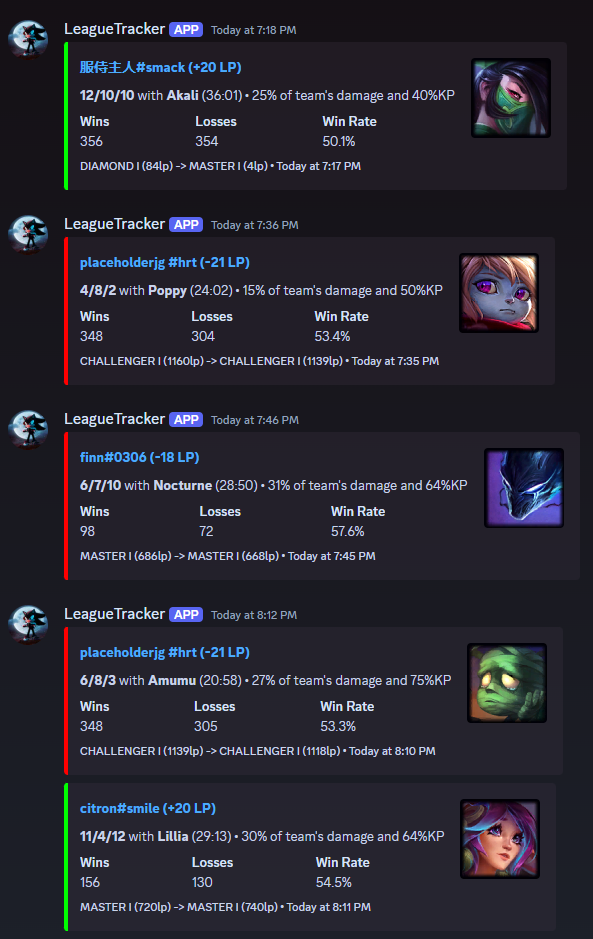

# League Tracker Discord Bot

League Tracker is a Discord app that "tracks" League of Legends players' ranked solo/duo queue matches and provides
updates on their performance. The bot is designed to be added to Discord servers where users can follow specific
summoners and receive notifications about their recent matches, including rank changes and game statistics.

## ✨ Features

- 📊 Track multiple League of Legends summoners in one place
- 🔔 Automatically fetch and announce new ranked solo/duo queue matches
- 🏆 Display detailed match information (champion, KDA, damage dealt, and more)
- 📈 Show rank changes and LP gains/losses
- 📜 Maintain a history of tracked matches and summoner statistics
- 🎛️ Simple command interface for managing tracked summoners



## 🛠️ Tech Stack

- Go (Golang)
- PostgreSQL
- Discord API (via discordgo library)
- Riot Games API for League of Legends data

## 📋 Prerequisites

Before diving in, make sure you have:

- Go 1.22 or later
- PostgreSQL
- A Discord bot token ([Create one here](https://discord.com/developers/applications/))
- A Riot Games API key ([Get a development key here](https://developer.riotgames.com/))

## 🚀 Setup

1. **Clone the repository:**

   ```sh
   git clone https://github.com/tristan-derez/league-tracker.git
   cd league-tracker
   ```

2. **Install dependencies:**

   ```sh
   go mod tidy
   ```

3. **Set up environment variables:**

   Create a `.env` file in the root directory based on `.env.example`.

   - Unix-like systems (Linux, macOS):
     ```sh
     cp .env.example .env
     ```
   - Windows PowerShell:
     ```sh
     Copy-Item .env.example .env
     ```

4. **Quick Start with Docker:**

   ```sh
   docker compose up
   ```

   > 💡 If using Docker, you can skip steps 5 & 6.

5. **Database Setup:** Ensure your PostgreSQL server is running. The bot will create necessary tables on startup.

6. **Build and Run:**
   ```sh
   go build -o league-tracker
   ./league-tracker
   ```

## 📖 Usage

Once your bot is up and running, use these commands in your Discord server:

- Add summoners:
  ```
  # add one summoner:
  /add summonerName#tagLine
  # add multiple summoners:
  /add summonerName1#tagLine1, summonerName2#tagLine2
  ```
- Remove summoners:
  ```
  # remove one summoner:
  /remove summonerName#tagLine
  # remove multiple summoners:
  /remove summonerName1#tagLine1, summonerName2#tagLine2
  # remove every summoners from tracking:
  /reset
  ```
- List tracked summoners:
  ```
  /list
  ```
- Manage update channel:
  ```
  # Remove current channel from update channel:
  /unchannel
  ```

> 📌 To invite your bot to a server, check the installation section in Discord Developer Portal > Your App >
> Installation

## 🤝 Contributing

We welcome contributions! Feel free to submit a Pull Request.

## 📄 License

This project is open-source under the [MIT License](LICENSE).

## 💬 Support

Encountered an issue or have questions? Open an issue on our GitHub repository.


---
